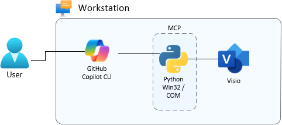

# Visio MCP Server

Are you a solution architect looking to build high‑quality architecture diagrams or evolve existing ones to reflect recent changes? We’ve got you covered.

The Visio MCP (Model Context Protocol) Server exposes Microsoft Visio diagram operations as tools, enabling you to generate production‑grade architecture diagrams from text descriptions, images, and documents.

By directly controlling Microsoft Visio, this MCP server supports not only initial diagram generation but also iterative refinement and evolution. You can continuously improve and adapt diagrams until they meet the highest quality standards.

The Visio MCP Server is designed for use with GitHub Copilot CLI and VS Code Agent Mode, but it can also be integrated with other LLM-based systems.



## Features

- **Azure service icons** — 206 Azure services from official Visio stencils (auto-discovered)
- **Architecture helpers** — tier bands, containers, connectors with style-guide compliance
- **Shape operations** — add, modify, remove, connect, and list shapes
- **Multi-page support** — add pages, switch between them
- **Export** — PNG, SVG, JPG output

## Prerequisites

- **Microsoft Visio Professional** (installed and licensed)
- **Python 3.11+**
- **Azure Visio stencils** — download from [Microsoft Azure Architecture Icons](https://learn.microsoft.com/en-us/azure/architecture/icons/) and extract to your `My Shapes` folder

## Installation

```bash
cd visio-mcp
pip install -r requirements.txt
```

## Configuration

Add to your Copilot CLI MCP config (`~/.copilot/mcp-config.json`):

```json
{
  "mcpServers": {
    "visio": {
      "type": "stdio",
      "command": "python",
      "args": ["C:\\path\\to\\visio-mcp\\server.py"],
      "env": {}
    }
  }
}
```

### Whitelisting All Visio Tools

By default, Copilot CLI prompts for approval on each MCP tool call. To auto-approve all Visio MCP tools while keeping other tools at normal approval prompts, launch with:

```bash
copilot --allow-tool "visio"
```

To whitelist a specific tool only:

```bash
copilot --allow-tool "visio(add_azure_shape)"
```

To persist across sessions, add to `~/.copilot/config.json`:

```json
{
  "allowedTools": ["visio"]
}
```

## Available Tools

| Tool | Description |
|---|---|
| `create_diagram` | Create a new Visio diagram (landscape, 11×8.5 in) |
| `save_diagram` | Save to `.vsdx` file |
| `close_diagram` | Close without saving |
| `list_open_diagrams` | List all open documents |
| `add_shape` | Add basic shapes (rectangle, ellipse, diamond, etc.) |
| `add_azure_shape` | Add Azure service icons from official stencils |
| `remove_shape` | Remove a shape by ID |
| `modify_shape` | Change text, position, size, or color |
| `list_shapes` | List all shapes on the active page |
| `connect_shapes` | Connect two shapes with styled connectors |
| `remove_connection` | Remove a connector |
| `add_container` | Add a grouping boundary rectangle |
| `add_tier_band` | Add a full-width horizontal tier band |
| `add_text_label` | Add a floating text label |
| `list_azure_services` | List all 206 available Azure service keys |
| `list_stencil_masters` | List masters in a specific stencil |
| `open_stencil` | Open an Azure stencil by name |
| `add_page` | Add a new page |
| `set_active_page` | Switch to a page by index |
| `list_pages` | List all pages |
| `export_page` | Export page as image (PNG, SVG, JPG) |

## Azure Stencil Discovery

The server automatically discovers Azure stencils by querying Visio's COM properties:

1. `Visio.Application.MyShapesPath` — user stencils folder
2. `Visio.Application.GetBuiltInStencilFile()` — built-in content directory
3. `Visio.Application.Path` — install location
4. Windows Shell `CSIDL_PERSONAL` — real Documents folder (handles OneDrive redirect)

Discovered stencil directories are registered in Visio's `StencilPaths` for native COM resolution. No hardcoded paths.

## Style Guide

All shapes and connectors are automatically styled per `STYLE_GUIDE.md`:

- Shapes: rounded corners (0.06 in), 15% transparent fills
- Connectors: filled triangle arrowheads, 1 pt weight, 7 pt label font
- Containers: dashed border, 60% transparent, 9 pt label
- Tier bands: 70% transparent, bold 8 pt label

## Example

```
Create a 3-tier Azure architecture with Front Door, VM Scale Sets in 2 availability zones, and Azure SQL with replication
```

The server will create a professional Visio diagram with proper Azure icons, tier bands, containers, and styled connectors.

## See also
Also you can explore other MCP for simpiar tasks that generates architecture in different formats:
| Project | Type | Description | Link |
|------|------|------------|------|
| **draw.io MCP (official)** | MCP Server | Official draw.io Model Context Protocol server. Opens and generates diagrams directly in the draw.io editor. Supports native XML, CSV, and Mermaid inputs. | https://github.com/jgraph/drawio-mcp |
| **drawio-mcp-server** | MCP Server | Community MCP server providing full programmatic control over draw.io diagrams, including creation, inspection, modification, and iterative refinement via an embedded editor. | https://github.com/lgazo/drawio-mcp-server |
| **draw_architecture_mcp** | MCP Server | Architecture‑focused MCP server for generating and maintaining draw.io diagrams from structured models (e.g. YAML). Well suited for large infrastructure and network diagrams. | https://github.com/dwgeneral/draw_architecture_mcp |
| **Excalidraw MCP** | MCP Server | MCP server for generating and evolving hand‑drawn‑style diagrams using Excalidraw, often paired with draw.io MCPs for different visual styles. | https://github.com/excalidraw/excalidraw-mcp |
| **Mermaid** | Diagram DSL | Text‑based diagram language commonly used as an intermediate format for MCP‑driven diagram generation (including draw.io imports). | https://mermaid.js.org |

## License

MIT
